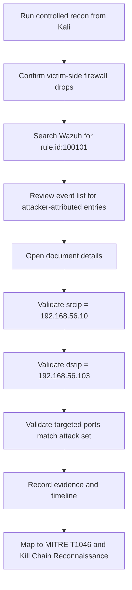

# Phase 1 Reconnaissance - Analyst Workflow

## Interpretation

This workflow highlights a real analyst lesson: an alert existing is not enough. The analyst still has to separate attacker-attributed evidence from lab background noise.
