# Phase 1 Reconnaissance - Telemetry Flow

```mermaid
flowchart LR
    A["Kali Linux Attacker<br/>192.168.56.10"] -->|"Nmap TCP recon<br/>22, 135, 139, 445, 3389"| B["Windows 10 Victim<br/>192.168.56.103"]
    B -->|"Windows Firewall blocks inbound probes"| C["pfirewall.log"]
    C -->|"Wazuh agent collects log source"| D["Wazuh Manager"]
    D -->|"windows-firewall decoder parses fields"| E["Base rule 4101<br/>Firewall drop event"]
    E -->|"same source IP + repeated events"| F["Local rule 100101<br/>PORT SCAN DETECTED"]
    F --> G["Threat Hunting / Analyst Review"]
```

## Interpretation

- The attack signal was not strongest in Sysmon for this scenario.
- The decisive evidence source was the Windows Firewall drop log.
- The defender story became strong only after collection, parsing, and correlation were aligned.
