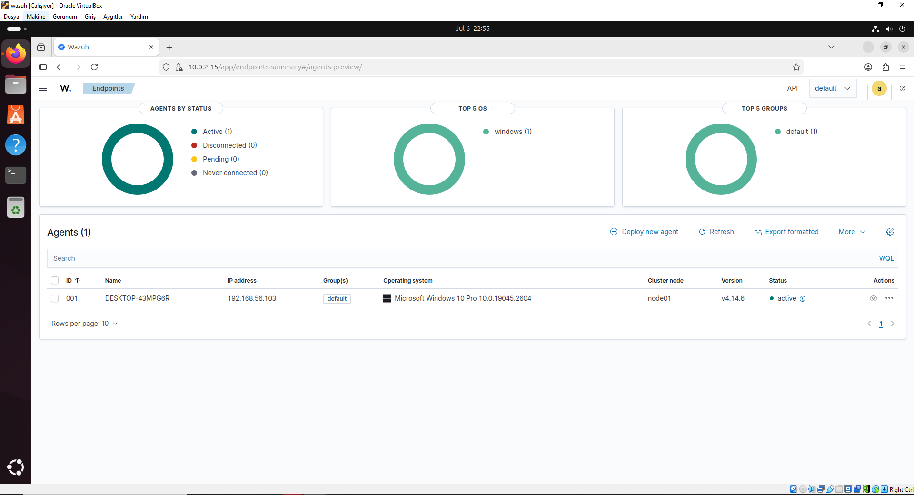
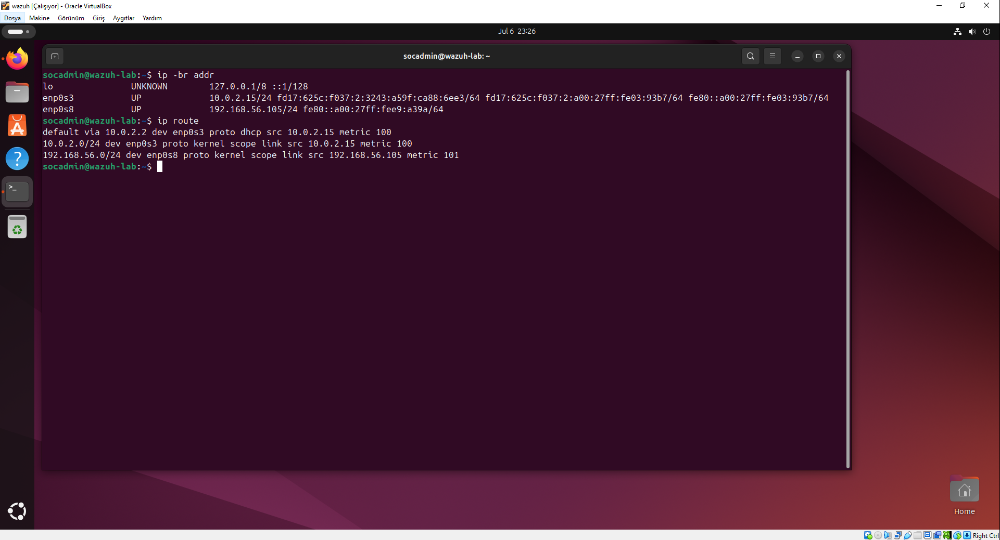
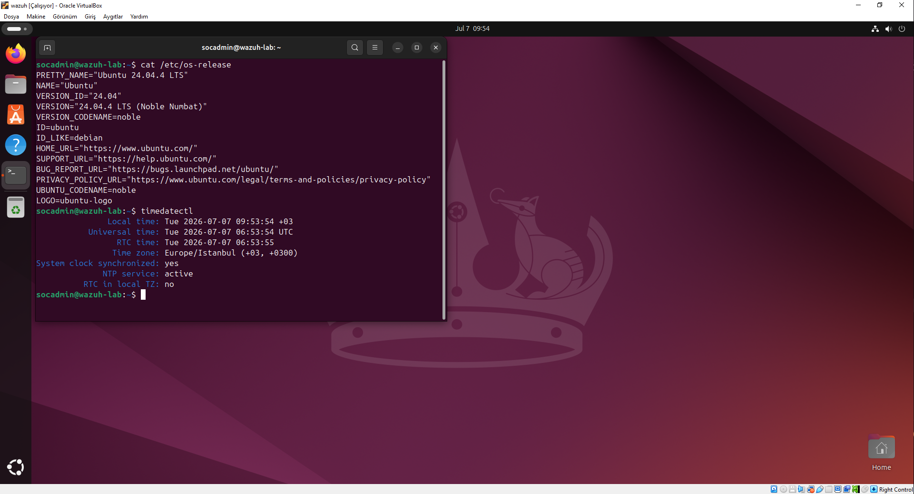
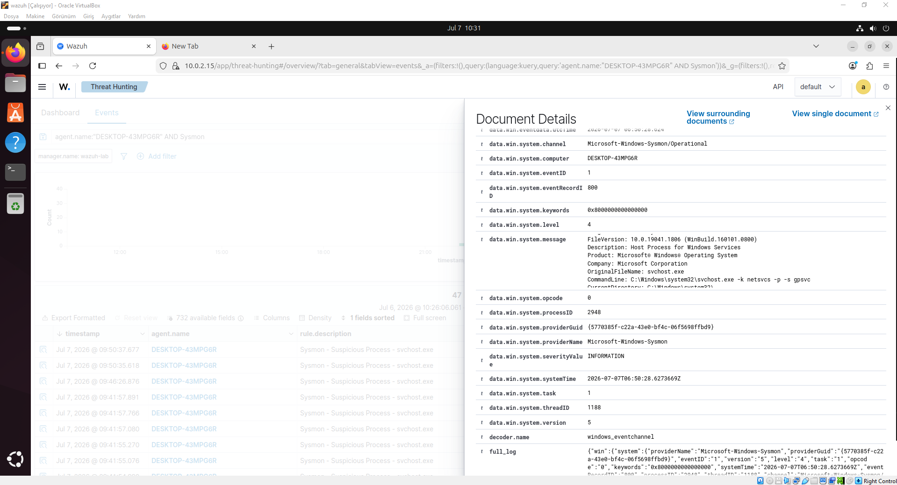
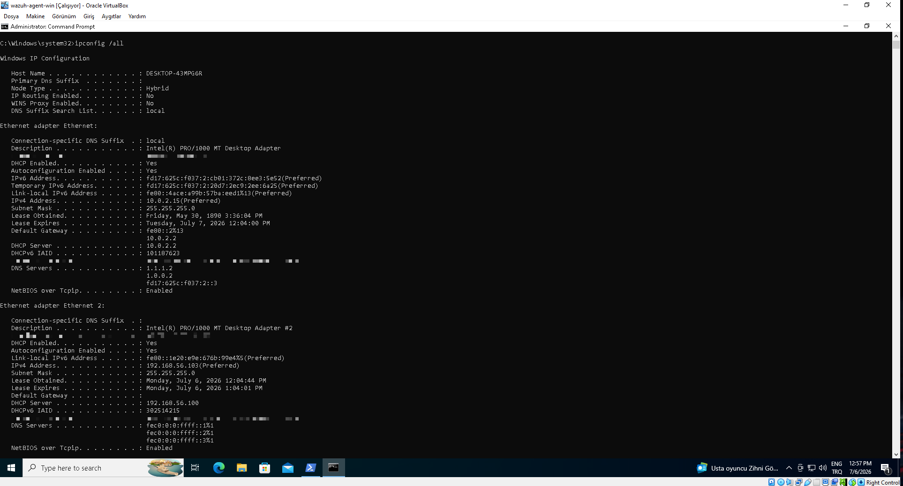
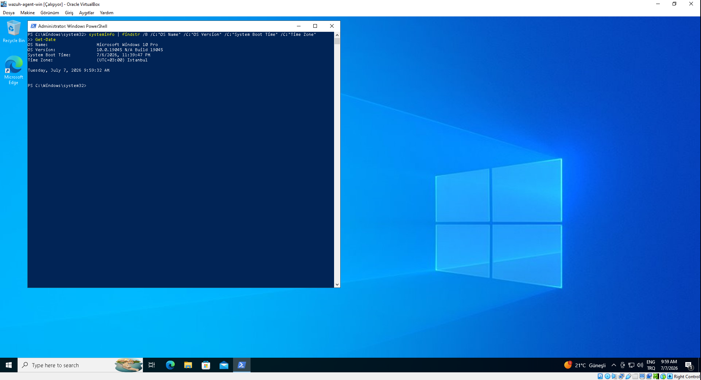
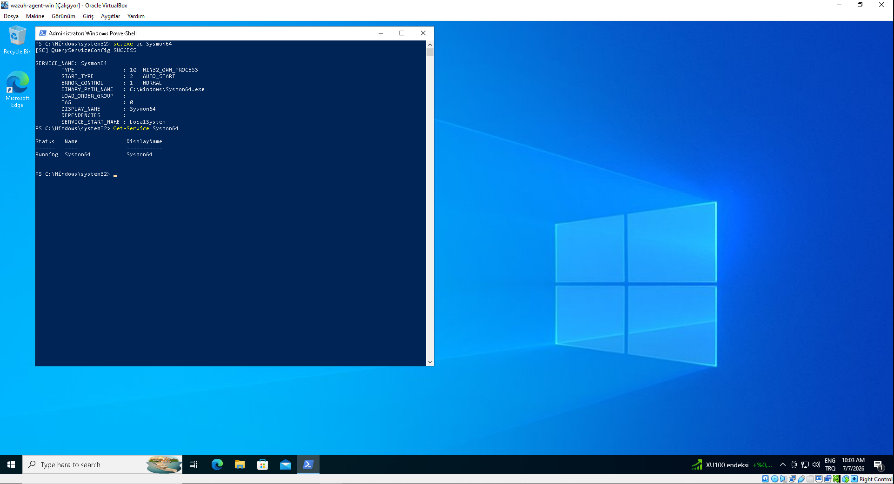
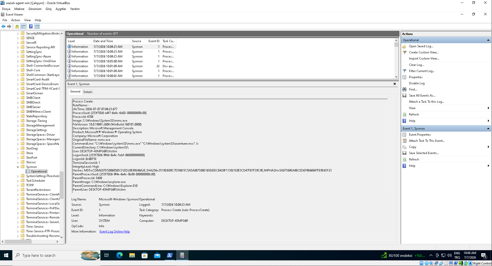
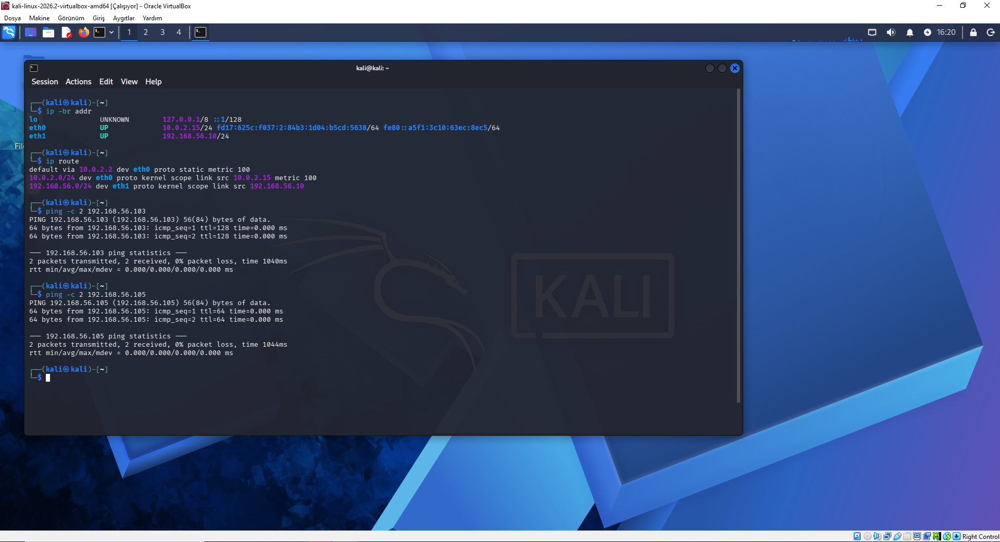
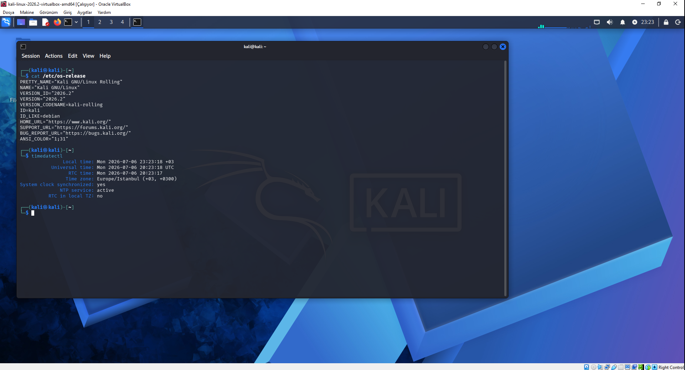

# Lab Baseline Evidence

## Purpose

This evidence pack documents the validated Phase 1 baseline from platform health through endpoint telemetry generation and Wazuh ingestion.

## Preview Gallery

### Wazuh Server and Dashboard

#### E-001 Wazuh Agent Enrollment

#### E-002 Wazuh Server Network

#### E-003 Wazuh Server Version and Time

#### E-004 Wazuh Ingestion of Sysmon Event ID 1

### Windows Victim

#### E-005 Windows Network Configuration

#### E-006 Windows Version and Time

#### E-007 Windows Sysmon Service Health

#### E-008 Windows Sysmon Event ID 1

### Kali Attacker

#### E-009 Kali Connectivity Validation

#### E-010 Kali Version and Time

## Evidence Manifest

| ID | File | Source VM | Purpose | Sanitized |
|---|---|---|---|---|
| E-001 | [`01-wazuh-agent-active.png`](assets/screenshots/lab-baseline/01-wazuh-agent-active.png) | Wazuh | Confirms that the Windows Wazuh agent is enrolled and active in the dashboard. | Yes |
| E-002 | [`02-wazuh-server-network.png`](assets/screenshots/lab-baseline/02-wazuh-server-network.png) | Wazuh | Records the Wazuh server dual-interface addressing and default route. | Yes |
| E-003 | [`03-wazuh-server-version-time.png`](assets/screenshots/lab-baseline/03-wazuh-server-version-time.png) | Wazuh | Confirms the SIEM host version, timezone, and active NTP synchronization. | Yes |
| E-004 | [`04-wazuh-sysmon-event-id-1-ingested.png`](assets/screenshots/lab-baseline/04-wazuh-sysmon-event-id-1-ingested.png) | Wazuh | Confirms Wazuh ingestion and parsed indexing of Sysmon `Event ID 1`. | Yes |
| E-005 | [`05-windows-network-configuration.png`](assets/screenshots/lab-baseline/05-windows-network-configuration.png) | Windows victim | Records the Windows victim network configuration and dual-network layout. | Yes |
| E-006 | [`06-windows-version-time.png`](assets/screenshots/lab-baseline/06-windows-version-time.png) | Windows victim | Confirms Windows version and corrected lab-aligned timezone. | Yes |
| E-007 | [`07-windows-sysmon-service-status.png`](assets/screenshots/lab-baseline/07-windows-sysmon-service-status.png) | Windows victim | Confirms that Sysmon is installed, auto-started, and running. | Yes |
| E-008 | [`08-windows-sysmon-operational-event-id-1.png`](assets/screenshots/lab-baseline/08-windows-sysmon-operational-event-id-1.png) | Windows victim | Confirms endpoint-side Sysmon `Event ID 1` generation in Event Viewer. | Yes |
| E-009 | [`09-kali-network-connectivity.png`](assets/screenshots/lab-baseline/09-kali-network-connectivity.png) | Kali | Confirms Kali host-only reachability to the Windows victim and Wazuh server. | Yes |
| E-010 | [`10-kali-version-time.png`](assets/screenshots/lab-baseline/10-kali-version-time.png) | Kali | Confirms the attacker VM version, timezone, and synchronized time state. | Yes |

## SHA-256 Inventory

| File | SHA-256 |
|---|---|
| `01-wazuh-agent-active.png` | `803705818626726F708C56128073A7FD835585688394863C50BE2D87EDC8F1A4` |
| `02-wazuh-server-network.png` | `FF91062E5C662FDC5DCAE6D12A48F6BC3FDE9EB1676794ED722BF00A5AFE6017` |
| `03-wazuh-server-version-time.png` | `D2532BA83CC3D6BE2880259ACB83BB86CD0C9E28E59C666B8E7B9835D6943201` |
| `04-wazuh-sysmon-event-id-1-ingested.png` | `10DA8A6B2C86638EFEF033D3896E83CB9B14A10C60236747B9EC36B5A37A734E` |
| `05-windows-network-configuration.png` | `4E1B4BF1C510A3BA8F0DBFBE4F85CF9A96661FE713439987E32A359991B64F76` |
| `06-windows-version-time.png` | `D2BCE053ADCFDAB92245351C22A1AD67F3B9258DB7002F75FDC23627096866DB` |
| `07-windows-sysmon-service-status.png` | `7D2889FCFF93BFF50C420BAF180D1D58034ECFEC117A49CEE05846425F2A6514` |
| `08-windows-sysmon-operational-event-id-1.png` | `BB65F4FB7089494A9C5B9BE025EDDE17A344CB92AFC622CD2DEA6321BADC1679` |
| `09-kali-network-connectivity.png` | `5FEBE9E3C17EB659F0A4C2AFFA48135A010B368890D76581922A9A5C1B8AEB53` |
| `10-kali-version-time.png` | `8128768A2B3039C00B0454CBFB81722B365DE057093338A7508147D1E83BED34` |

## Notes

- Windows and Wazuh screenshots intentionally preserve lab hostnames, internal host-only addresses, and event metadata because they are necessary to establish provenance.
- Sensitive values unrelated to the lab objective were redacted before publication where needed.
- This evidence pack is organized by source VM to make review and validation easier.
- This evidence pack is the prerequisite for the first published scenario in Phase 2.
