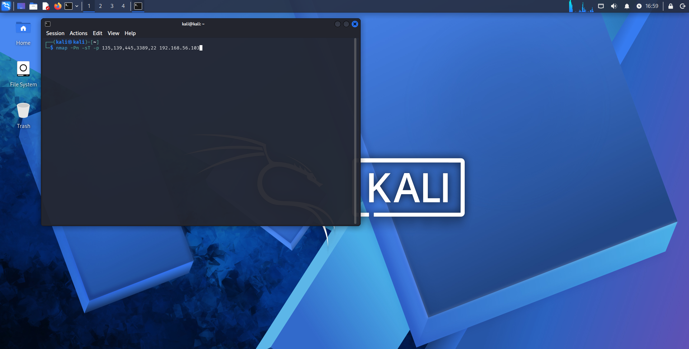
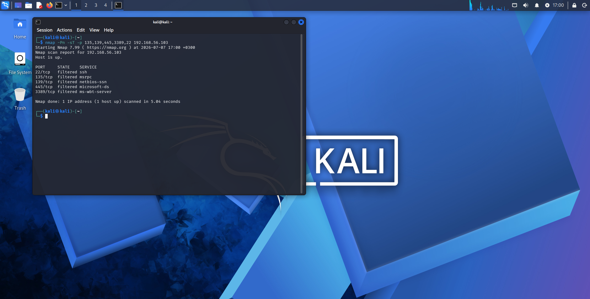
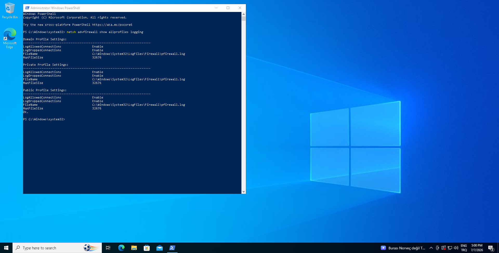
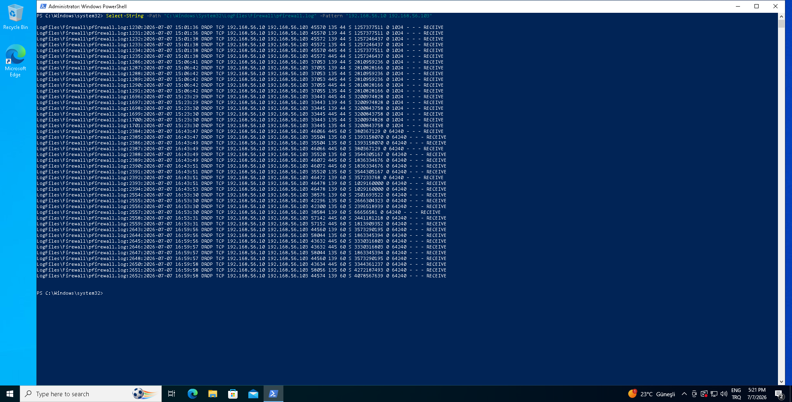
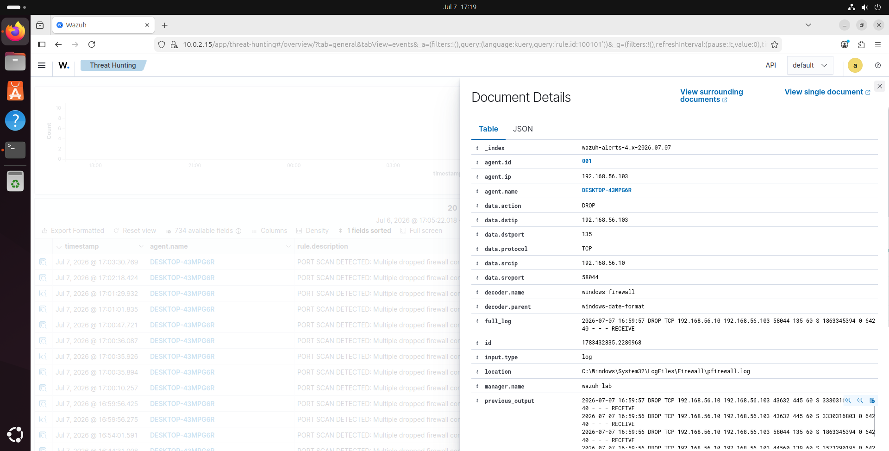
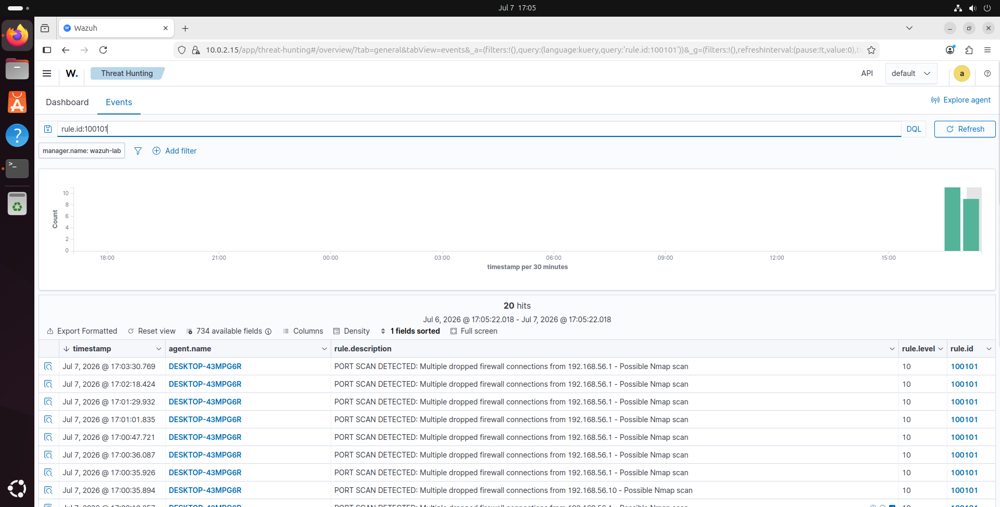

# Scenario 01 - Reconnaissance - Nmap Discovery

## Executive Summary

This case study documents a controlled reconnaissance action from the Kali attacker VM to the Windows 10 victim using Nmap. The original objective was simple host and service discovery, but the more valuable outcome was detection engineering: default Wazuh and Sysmon visibility did not provide a clean attacker-to-defender story for inbound scan activity, so Windows Firewall logging was enabled and integrated into Wazuh to produce a correlated `PORT SCAN DETECTED` alert (`rule.id:100101`).

The final scenario now demonstrates the full portfolio workflow:

- attacker-side execution from Kali
- victim-side evidence in the Windows Firewall log
- defender-side correlation and review in Wazuh Threat Hunting

## Technical Lead Notes

This case study is intentionally framed as a detection engineering exercise, not just an attack walkthrough. The value of the scenario is that it captures the full engineering loop:

- identify a weak default visibility pattern,
- select a better evidence source,
- validate parsing and correlation behavior,
- preserve only the attacker-attributed evidence for the final analyst story.

That is the difference between a basic homelab demonstration and a professional SOC case study.

## Scenario Outcome

| Area | Result |
|---|---|
| Attack execution | Successful |
| Victim-side evidence | Confirmed in `pfirewall.log` |
| Wazuh ingestion | Confirmed |
| Custom detection | Confirmed |
| MITRE mapping | Confirmed |
| Incident report quality | Ready for publication |

## Objective

Perform a controlled TCP reconnaissance action from Kali against the Windows victim and verify whether the activity can be:

1. executed in a repeatable way,
2. observed on the target host,
3. correlated into a defender-usable Wazuh alert.

## Lab Scope

| Role | Host | Address |
|---|---|---|
| Attacker | Kali Linux | `192.168.56.10` |
| Victim | Windows 10 | `192.168.56.103` |
| SIEM | Wazuh | `192.168.56.105` |

## Scenario Narrative

The initial reconnaissance attempts showed a common homelab problem: attacker activity was visible on Kali, but the defender story was weak. Sysmon did not provide a clean inbound-scan narrative for this specific use case, and default Wazuh rules did not produce a portfolio-grade detection for the Nmap probe set.

To close that visibility gap, Windows Firewall drop logging was enabled, the firewall log was added as a Wazuh agent source, and a local Wazuh correlation rule was written to detect repeated dropped connections from the same source IP within a short time window.

This changed the scenario from "Nmap ran" to a much stronger SOC story:

- Kali attempted service discovery against common Windows exposure ports
- Windows recorded repeated dropped inbound TCP connection attempts
- Wazuh correlated those dropped connections into a high-confidence reconnaissance alert

## Attack Execution

The final published recon command was:

```bash
nmap -Pn -sT -p 135,139,445,3389,22 192.168.56.103
```

Why this command was selected:

- `-Pn` avoids host-discovery ambiguity and treats the target as online
- `-sT` uses a TCP connect scan that creates clear victim-side firewall telemetry
- the port set is small, explainable, and relevant to Windows service exposure

Observed attacker-side result:

- target was up
- all selected ports were filtered
- no service exposure was returned to the attacker

That result is operationally realistic: reconnaissance can fail from the attacker perspective while still producing strong defensive evidence.

## Detection Engineering Summary

### Visibility Gap

Default endpoint and SIEM telemetry did not produce a clean, directly attributable inbound-scan alert suitable for the case study. This is an important finding, not a failure: many SOC labs discover that host telemetry alone is not enough for early-stage network reconnaissance.

### Improvement Applied

The following changes were introduced:

- enabled Windows Firewall logging for dropped and allowed connections
- added `C:\Windows\System32\LogFiles\Firewall\pfirewall.log` to the Windows Wazuh agent configuration
- created a local decoder for Windows Firewall log lines
- created a local correlation rule that escalates repeated firewall drop events into a reconnaissance alert

### Final Detection Logic

The final Wazuh alert of interest is:

- `rule.id:100101`
- description: `PORT SCAN DETECTED: Multiple dropped firewall connections from <srcip> - Possible Nmap scan`

This rule is built on repeated matches of the built-in firewall drop rule `4101`, grouped by source IP within a short timeframe.

## Detection Workflow

```text
Kali Nmap Recon
  -> Windows Firewall blocks inbound probes
  -> pfirewall.log records repeated DROP entries
  -> Wazuh agent collects firewall log
  -> local decoder parses firewall fields
  -> built-in rule 4101 matches firewall drop events
  -> local rule 100101 correlates repeated drops by source IP
  -> analyst validates the attacker-attributed Wazuh event
```

## Detection Logic Snapshot

| Layer | Implementation | Purpose |
|---|---|---|
| Telemetry source | `C:\Windows\System32\LogFiles\Firewall\pfirewall.log` | Preserves host-side evidence of blocked inbound probes |
| Decoder | `windows-firewall` | Extracts source IP, destination IP, port, protocol, and action |
| Base rule | `4101` | Identifies individual Windows Firewall drop events |
| Correlation rule | `100101` | Escalates repeated drops into reconnaissance detection |
| Correlation threshold | `5 events / 30 seconds / same source IP` | Converts repeated probes into an analyst-meaningful alert |

## Evidence Gallery

### 01 - Attack command



Shows the exact Nmap command executed from Kali against the Windows victim.

### 02 - Attack result



Shows that the Windows victim responded as online while the selected ports remained filtered.

### 03 - Endpoint logging enabled



Confirms that Windows Firewall logging for dropped connections was enabled across profiles before the final run.

### 04 - Endpoint evidence



Shows repeated `DROP TCP 192.168.56.10 192.168.56.103` records in the victim firewall log for the scanned ports.

### 05 - Wazuh alert list


Shows the correlated `PORT SCAN DETECTED` events returned by `rule.id:100101`.

### 06 - Wazuh event details



Shows the attacker IP (`192.168.56.10`), victim IP (`192.168.56.103`), destination port (`135`), source evidence location (`pfirewall.log`), and correlation context from previous dropped events.

### 07 - Analyst query context



Shows the `rule.id:100101` query in Threat Hunting and highlights that the analyst must select the attacker-attributed event instance rather than unrelated background noise.

## Investigation Findings

### Attacker Perspective

- Reconnaissance reached the target successfully.
- The victim did not expose the selected ports.
- The scan still generated enough signal to be investigated and detected.

### What the Attacker Learned

- the target host was alive,
- targeted services were filtered rather than openly exposed,
- a network control was actively blocking probes,
- deeper service discovery would require a different approach or later-stage tradecraft.

### Victim Perspective

- Windows Firewall recorded repeated inbound TCP drops from `192.168.56.10`.
- The dropped connection pattern covered the exact ports probed by the attacker.
- The host prevented exposure while preserving evidence.

### Defender Perspective

- Wazuh ingested the victim firewall log successfully.
- The local decoder parsed source IP, destination IP, ports, action, and protocol.
- The correlation rule escalated repeated firewall drops into a level 10 alert.
- Background noise from `192.168.56.1` existed in the environment, so analyst validation of the attacker IP was necessary.

## MITRE ATT&CK Mapping

| Tactic | Technique | ID | Rationale |
|---|---|---|---|
| Discovery | Network Service Discovery | T1046 | The attacker probed common Windows service ports to determine target exposure. |

## Cyber Kill Chain Mapping

| Phase | Rationale |
|---|---|
| Reconnaissance | The attacker performed pre-exploitation target discovery to learn whether exposed services were reachable. |

## Detection Assessment

| Question | Assessment |
|---|---|
| Did the attack execute? | Yes |
| Did the victim record it? | Yes |
| Did Wazuh alert on it by default? | No |
| Was the visibility gap closed? | Yes, through Windows Firewall log ingestion and local rule correlation |
| Is the result portfolio-grade? | Yes |

## Lessons Learned

1. A failed attacker outcome can still be a successful SOC case study if the telemetry chain is strong.
2. Reconnaissance often requires network-adjacent evidence sources; default endpoint telemetry may be insufficient.
3. Background lab noise can trigger the same correlation rule, so source-IP validation matters during investigation.
4. Detection engineering is part of the story, not an embarrassing workaround; documenting the visibility gap makes the project stronger.

## Why This Scenario Strengthens the Portfolio

This scenario now shows more than tool usage. It demonstrates:

- controlled adversary emulation,
- victim-side evidence preservation,
- SIEM ingestion validation,
- custom detection engineering,
- analyst review under noisy background conditions,
- standards-based ATT&CK and Kill Chain mapping.

That combination is much closer to real SOC engineering work than a simple "ran Nmap, got alert" walkthrough.

## Next Scenario Readiness

This scenario establishes the repeatable structure for later phases:

- controlled attack execution
- victim-side evidence collection
- SIEM-side detection validation
- analyst investigation and written assessment

Phase 3 can now move into controlled execution activity with a much stronger evidence standard already proven.
